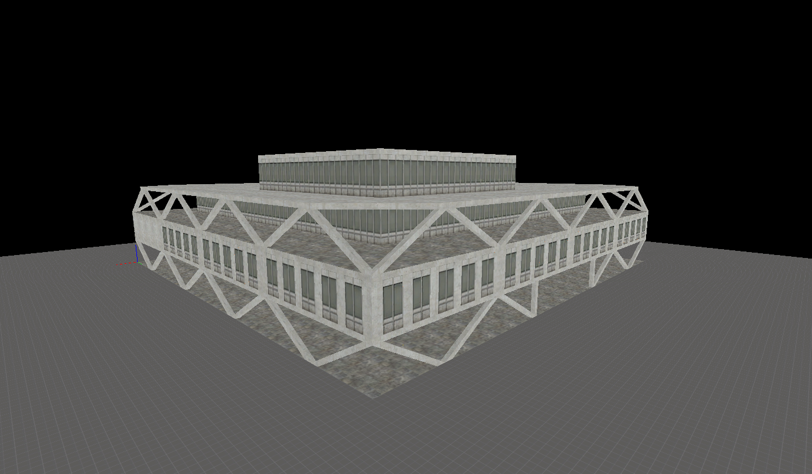

# Source engine of fictional east european city building

Created 2015-11-08

## To launch in the Hammer editor:

- Install the Source SDK Base 2013 single player from Steam "Tools" section
- Install Source SDK from Steam "Tools" section
- Run hammer via the hammer.exe in `steamapps\common\Half-Life 2\bin\hammer.exe`

## Running the map:

- Open in Hammer and click the "Run Map!" icon 

## Screenshot:

## Additional links

https://www.reddit.com/r/SourceEngine/comments/2howir/lighting_rooms_with_light_environment/
